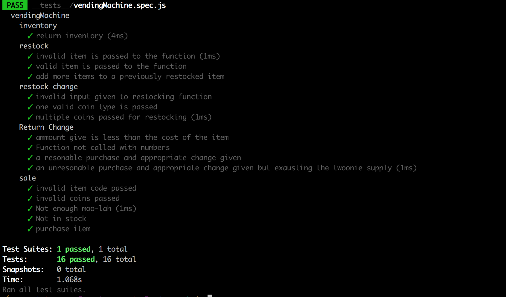

# Vending Machine

#### Goal

To use test driven development to validate the functions written for a command line vending machine

### To use

Clone this repo and run: `$ npm install`
use: `$ jest` to run the test suite

#### Technical description

This project uses jest to test the validity of functions that:
-log inventory,
-refill inventory,
-refill change,
-despense change

#### Author:

Scott Livingstone
